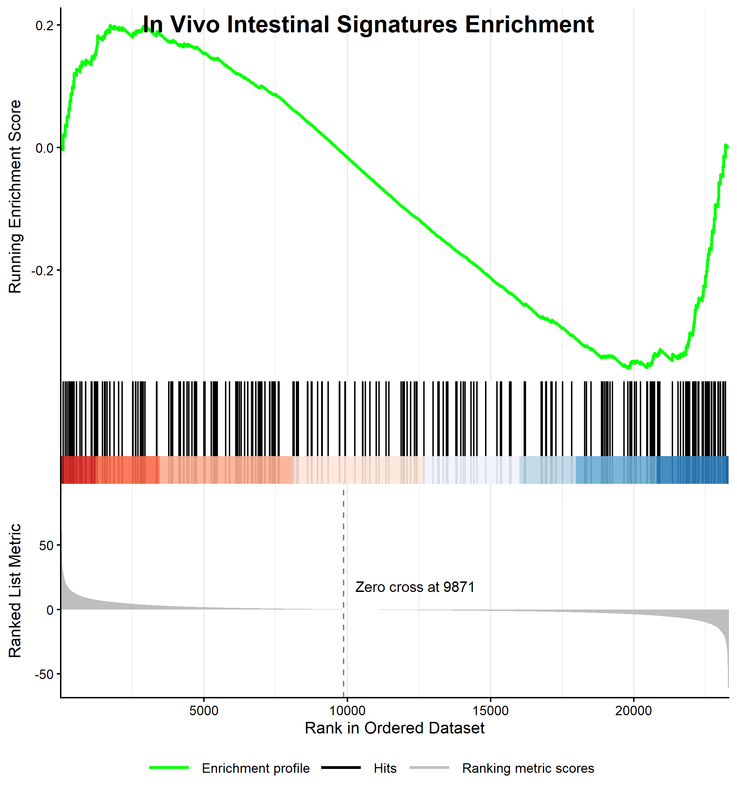
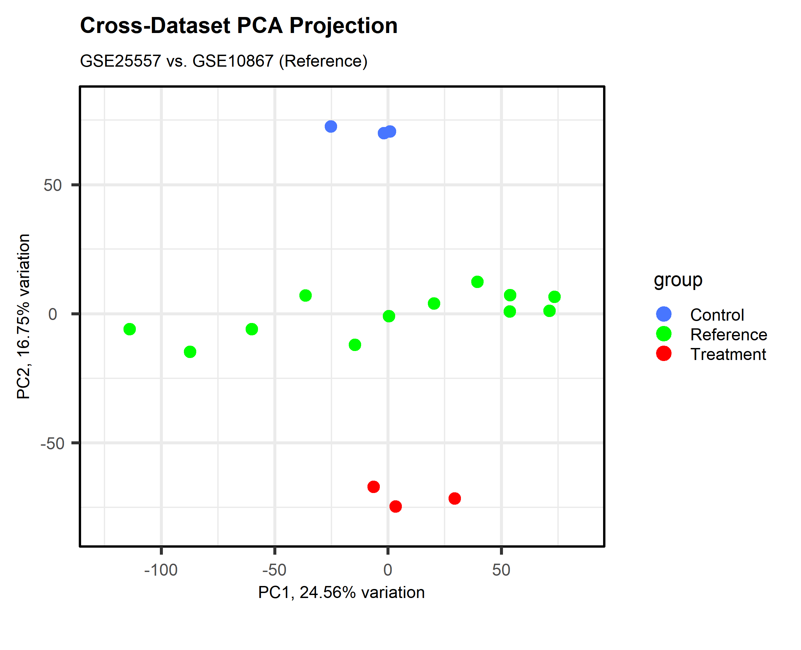
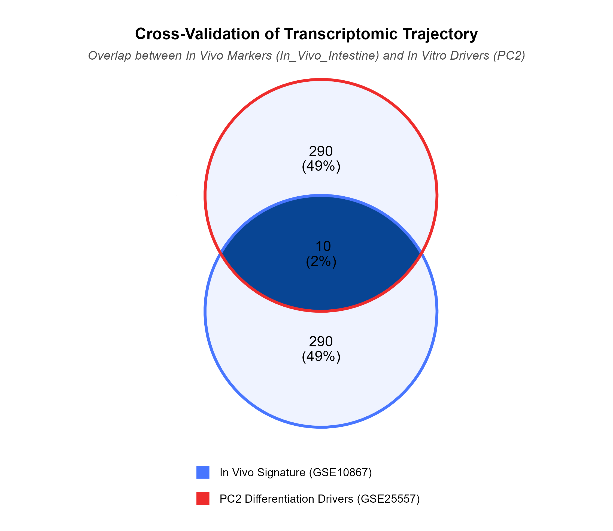
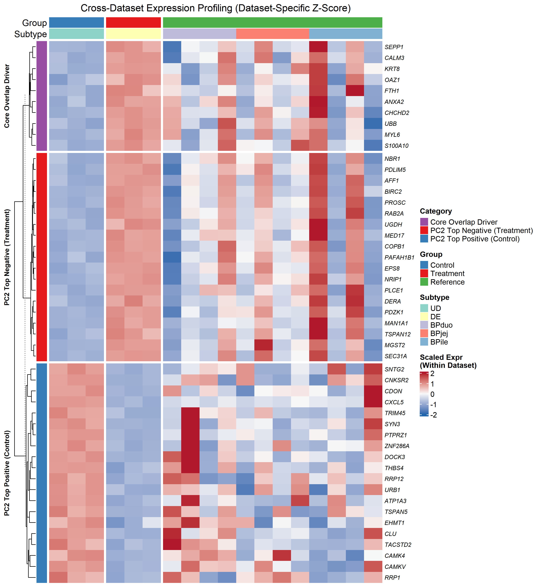
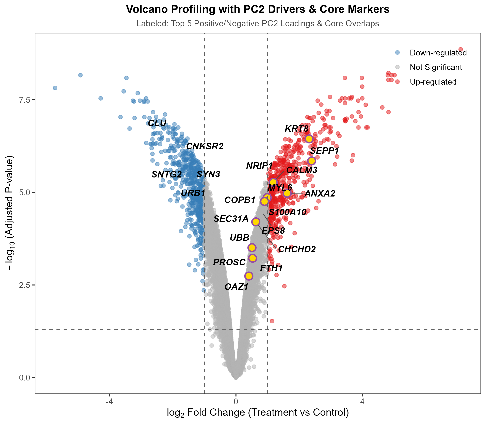
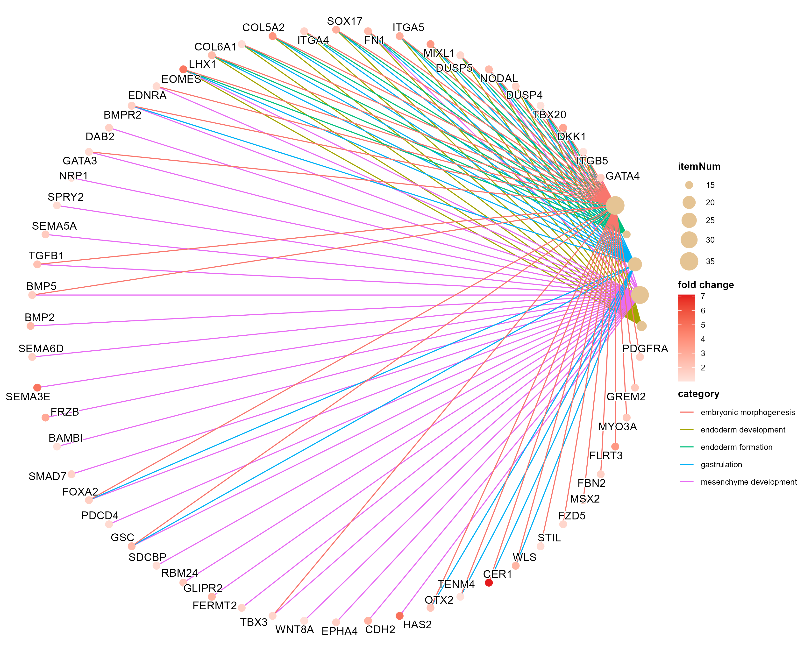
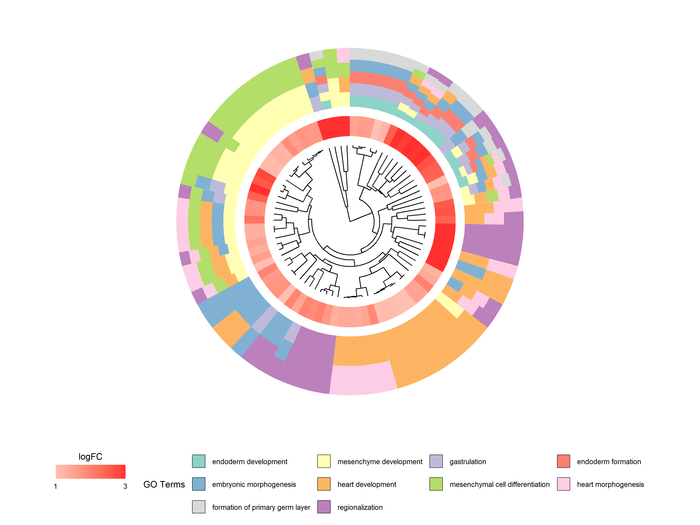
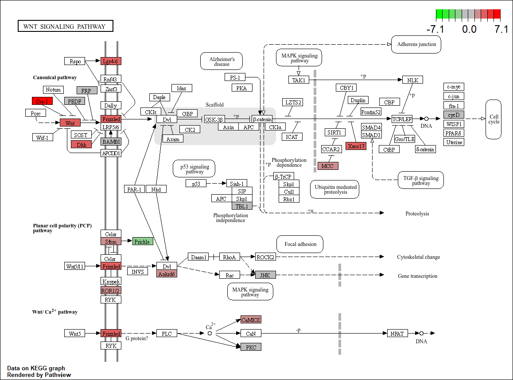

```{r setup, include=FALSE}
# Set global chunk options
knitr::opts_chunk$set(
  echo = TRUE, 
  warning = FALSE,
  message = FALSE,
  fig.align = "center",
  out.width = "100%"
)
```

```{r load-packages}
# Load core packages for interaction and data visualization
library(data.table)
library(tidyverse)
library(DT)
library(plotly)
library(ggplot2)
```

# Dataset Summary & Experimental Design

**In Vitro Dataset — GSE25557**

* **Source Study:** Spence et al. (2011), Nature (*Directed differentiation of human pluripotent stem cells into intestinal tissue in vitro*).
* **Cell Line:** Human embryonic stem cell line (hESC - H9).
* **Group Definitions:** 
  * **Control (con):** Undifferentiated state (H9-UD, biological triplicates).
  * **Treatment (treat):** Induced definitive endoderm state (H9-DE, biological triplicates).
* **Platform:** Affymetrix Microarray.

**In Vivo Reference Dataset — GSE10867**

* **Source Study:** Comelli et al. (PMID: 19711126, 20186427).
* **Sample Scope:** Endoscopic tissue biopsies from healthy human adults (aged 20–30, 2 males and 2 females), covering multiple intestinal segments (including BPduo, BPjej, and BPile).
* **Role & Purpose:** Serves as the gold-standard benchmark for real in vivo intestinal tissue.

**Core Research Goal**  
By benchmarking against the in vivo reference dataset (GSE10867), this study quantitatively evaluates the extent to which directed differentiation in vitro ($\text{H9-UD} \rightarrow \text{H9-DE}$) shifts the transcriptomic landscape toward the signature of native human intestinal tissue.

---

# Executive Summary

**Project Highlights**

* **Dataset Scope:** Integrated analysis of in vitro experimental dataset (GSE25557) and in vivo intestinal reference dataset (GSE10867).
* **Core Methodology:** Cross-platform Z-score normalization, PCA Euclidean distance & progression ratio quantification, Limma differential expression testing, and advanced visualization via ComplexHeatmap and Pathview.
* **Deliverables:** Interactive DEG query tables, dynamic volcano plots, publication-ready pathway enrichment graphics, and complete reproducibility environment details.

---

# 🛠️ Analytical Pipeline Overview (Steps 1–8)

The standard bioinformatic analysis workflow implemented in this project consists of the following steps:

* **Step 1: Raw Data Fetching & Metadata Mapping (`01_get_geo.R`)**  
  Downloads GSE25557 (H9_UD vs H9_DE) and GSE10867 (BPduo, BPjej, BPile) expression matrices, maps probe IDs to gene symbols, and aggregates expression values into a unified matrix.
* **Step 2: Differential Expression & Signature Extraction (`02_limma_deg.R`)**  
  Performs Limma DEG analysis on the in vitro dataset ($\vert\log_2\text{FC}\vert \ge 1.0, \text{adj.P.Val} < 0.05$) while extracting the top 300 in vivo intestinal feature gene signatures.
* **Step 3: GSEA Profile Validation (`03_gsea_analysis.R`)**  
  Uses ranked gene lists to validate whether in vitro differentiation trends significantly enrich toward real in vivo intestinal signatures.
* **Step 4: Cross-Dataset PCA & Distance Evaluation (`04_pca_analysis.R`)**  
  Merges datasets using cross-dataset Z-score normalization, performs PCA, extracts PC loadings, and quantifies differentiation progress via Euclidean distance (Progression Ratio %).
* **Step 5: Transcriptomic Overlap Analysis (`05_venn_diagram.R`)**  
  Cross-references in vivo marker genes against PC2 driver genes to extract core intersection driver genes (Core Overlap Drivers).
* **Step 6: Comprehensive Expression Profiling (`06_comprehensive_heatmap.R`)**  
  Constructs a dual-clustered heatmap using ComplexHeatmap to display overall expression patterns across datasets.
* **Step 7: Customized Volcano Profiling (`07_volcano_plot.R`)**  
  Generates publication-ready volcano plots specifically highlighting PC drivers and core overlap markers.
* **Step 8: Functional Enrichment & Advanced Visualization (`08_enrichment_analysis.R`)**  
  Executes GO (BP) and KEGG enrichment analyses, generating cnetplots, GOCluster circular plots, and Pathview pathway topologies.

---

# 1. Primary DEG & GSEA Validation (Steps 2–3) {.tabset .tabset-fade}

## 🌋 Interactive Volcano Plot

```{r volcano-interactive}
if (file.exists("./GSE25557_deg_results.tsv")) {
  deg_df <- fread("./GSE25557_deg_results.tsv")
  
  p_volcano <- ggplot(deg_df, aes(x = logFC, y = -log10(adj.P.Val), 
                                  text = paste("Symbol:", symbol, 
                                               "<br>logFC:", round(logFC, 2), 
                                               "<br>P.adj:", format.pval(adj.P.Val, digits=3)))) +
    geom_point(aes(color = direction), alpha = 0.6, size = 1.5) +
    scale_color_manual(values = c("Down" = "#377EB8", "Ns" = "grey70", "Up" = "#E41A1C")) +
    geom_hline(yintercept = -log10(0.05), linetype = "dashed", color = "grey40") +
    geom_vline(xintercept = c(-1, 1), linetype = "dashed", color = "grey40") +
    theme_bw() +
    labs(title = "Interactive DEG Volcano Plot (Hover to View Gene Info)", 
         x = "log2 Fold Change", y = "-log10 Adjusted P-value")
  
  ggplotly(p_volcano, tooltip = "text")
}
```

## 📋 Full DEG Table (Searchable)

```{r deg-table}
if (exists("deg_df")) {
  datatable(
    deg_df,
    filter = 'top',
    extensions = 'Buttons',
    options = list(
      pageLength = 10,
      dom = 'Bfrtip',
      buttons = c('copy', 'csv', 'excel')
    )
  ) %>% 
    formatSignif(columns = c("P.Value", "adj.P.Val"), digits = 3) %>% 
    formatRound(columns = c("logFC", "t", "B"), digits = 2)
}
```

## 📈 GSEA Validation Plot

```{r gsea-plot, echo=FALSE}
if (file.exists("./GSE25557_GSE10867_GSEA_plot.png")) {
  
} else {
  cat("GSEA Plot image not found.")
}
```
**GSEA Result Interpretation**

* **Positive Enrichment Trend**:
  * The **Running Enrichment Score (RES)** curve ascends rapidly at the leading edge (left side, representing genes significantly upregulated in the *in vitro* differentiation/treatment group) and reaches a positive peak of approximately **0.20**.
  * This indicates a **significant synchronized upregulation trend** of the *in vivo* mature intestinal signatures (`In_Vivo_Intestine`) within the *in vitro* induced differentiation group (Treatment).
* **Hits Distribution**:
  * The dense black bars in the middle panel (Hits) are predominantly concentrated in the high $t$-statistic region on the left side of the ranked list (red zone), demonstrating that most key *in vivo* intestinal signature genes were successfully activated during *in vitro* induction.
* **Zero Cross Threshold**:
  * The zero-cross line for the $t$-statistic is located at **Rank 9871**, indicating that *in vitro* induction drove broad and profound transcriptomic reprogramming, with over 10,000 genes showing positive regulatory responses.

---

# 2. Cross-Dataset Trajectory & PCA Metrics (Step 4) {.tabset .tabset-fade}

## 📊 PCA Projection (Biplot)

```{r show-pca-biplot, echo=FALSE}
if (file.exists("./GSE25557_GSE10867_PCA_biplot.png")) {
  
} else {
  cat("PCA Biplot image not found.")
}
```
**Cross-Dataset PCA Projection Interpretation**

* **Axis Separation & Explained Variance**:
  * **PC1 (24.56% Variance)**: Primarily captures the **biological/technical heterogeneity within the *in vivo* reference samples** (GSE10867, Green points), spreading across the horizontal axis. Notably, both Control (Blue) and Treatment (Red) groups from the *in vitro* dataset (GSE25557) cluster narrowly around $\text{PC1} \approx 0$. This demonstrates that PC1 is largely driven by inter-individual tissue diversity or platform-specific variance inherent to the *in vivo* reference.
  * **PC2 (16.75% Variance)**: Serves as the **primary biological differentiation axis**. Control cells (undifferentiated stem cells, Blue) are localized at the positive extreme ($\text{PC2} \approx +70$), whereas Treatment cells (differentiated intestinal lineage, Red) shift dramatically down toward the negative region ($\text{PC2} \approx -70$).

## 📈 PC2 Component Loadings

```{r pc2-loadings}
if (file.exists("./GSE25557_GSE10867_PC2_loadings.tsv")) {
  pc_loadings <- fread("./GSE25557_GSE10867_PC2_loadings.tsv")
  
  datatable(
    pc_loadings,
    filter = 'top',
    caption = 'Table 1: PC2 Component Loadings for Cross-Dataset PCA',
    options = list(pageLength = 8, dom = 'Bfrtip')
  ) %>% formatRound(columns = c("loading"), digits = 4)
}
```

## 📏 Distance Metric & Progression Summary

```{r distance-summary}
if (file.exists("./GSE25557_GSE10867_PC1_PC2_distance_summary.tsv")) {
  dist_summary <- fread("./GSE25557_GSE10867_PC1_PC2_distance_summary.tsv")
  
  datatable(
    dist_summary,
    options = list(dom = 't'),
    rownames = FALSE,
    caption = 'Table 2: Quantified Euclidean Distance and Progression Ratio (%)'
  )
}
```
**Quantified Euclidean Distance & Progression Ratio Summary**

Based on the spatial centroids of each group in PC space ($\text{PC1} \times \text{PC2}$), Euclidean distances and the differentiation **Progression Ratio (%)** were calculated to quantify how closely the *in vitro* treatment matches the *in vivo* reference state:

$$\text{Progression Ratio (%)} = \frac{\text{Dist}(\text{Control}, \text{Ref}) - \text{Dist}(\text{Treatment}, \text{Ref})}{\text{Dist}(\text{Control}, \text{Ref})} \times 100\%$$
**Mathematical & Trajectory Interpretation**
   
   * The direct distance between Control and Treatment ($\text{Dist}_{\text{Control}\to\text{Treatment}} = 143.18$) is twice as large as the distance from Control to the *in vivo* reference ($\text{Dist}_{\text{Control}\to\text{Reference}} = 71.59$).
   * This confirms that the *in vitro* differentiation protocol induces a **massive transcriptomic overhaul**, far exceeding a subtle phenotypic change.

---

# 3. Core Overlap Drivers & Cross-Dataset Profiling (Steps 5–7) {.tabset .tabset-fade}

## ⭕ Venn Diagram (In Vivo vs. Drivers)

```{r venn-diagram, echo=FALSE}
if (file.exists("./GSE25557_GSE10867_overlapping_venn.png")) {
  
}
```

**Quantitative Venn Diagram Interpretation**

* **Core Overlapping Drivers (10 Genes, ~2%)**:
  * Out of 300 top genes selected from each dataset, **10 genes** are shared between the *in vivo* reference signature and the *in vitro* PC2 differentiation drivers.
  * These 10 shared genes represent the **essential transcriptomic bridge**—the conserved core molecular factors that *Spence et al.* successfully activated *in vitro* to mimic authentic *in vivo* intestinal fate specification.
  * The existence of the 10 core overlapping genes confirms that key transcriptional nodes governing human intestinal identity are reliably engaged during the stage-specific *in vitro* protocol (Activin A $\to$ FGF4/Wnt3a). This modest yet critical overlap supports the GSEA finding that the basic lineage specification program is successfully initiated.
* **Dataset-Specific Gene Subsets (290 Genes each, 49%)**:
  * **In Vivo Specific (290 genes)**: Genes uniquely elevated in mature adult intestinal tissue. These largely comprise mature physiological pathways, such as complex nutrient absorption machinery, specialized drug-metabolizing enzymes, and tissue-resident immune interactions.
  * **In Vitro Specific (290 genes)**: Genes driving the PC2 differentiation axis specifically in cultured cells. These reflect early developmental processes, extracellular matrix remodeling required for 3D organoid formation, and active culture-response signaling pathways.
  * As noted by *Spence et al.*, hPSC-derived intestinal organoids generated *in vitro* primarily resemble **fetal/embryonic intestinal tissue** rather than fully mature adult intestinal epithelium. Since GSE10867 represents adult intestinal segments, the top 300 *in vivo* markers are dominated by mature functional markers that remain unexpressed or expressed at lower levels in immature organoids.
  
## 🧬 Multi-Dataset ComplexHeatmap
  
```{r heatmap, echo=FALSE}
if (file.exists("./GSE25557_GSE10867_comprehensive_heatmap.png")) {
  
}
```

**Heatmap Pattern Interpretation**

* **Reciprocal Expression in In Vitro Differentiation**:
  * **PC2 Top Positive Genes (Bottom Block)**: Display strong upregulation in undifferentiated stem cells (Control / UD, high red signal) and complete suppression upon induction in Treatment (DE, deep blue signal). Key pluripotency/progenitor-associated genes (e.g., *SNTG2*, *CDON*, *PTPRZ1*) fall into this group.
  * **PC2 Top Negative Genes (Middle Block)**: Show the exact inverse pattern—silenced in Control (UD) and highly induced in Treatment (DE). This includes essential lineage/organoid structural and metabolic drivers (e.g., *KRT8*, *UGDH*, *EPS8*, *PDZK1*).

## 📌 Publication-Ready Static Volcano (Annotated)

```{r volcano-static, echo=FALSE}
if (file.exists("./GSE25557_GSE10867_volcano_plot.png")) {
  
}
```

---

# 4. Functional Enrichment & Biological Pathways (Step 8) {.tabset .tabset-fade}

## 🕸️ GO Cnetplot (Up-regulated)

```{r cnetplot, echo=FALSE}
if (file.exists("./GSE25557_cnetplot_Up.png")) {
  
}
```

**Key Enriched Biological Pathways & Gene Networks**

* **Core Germ Layer & Endodermal Commitment**:
  * Up-regulated genes are predominantly enriched in early definitive endoderm pathways, including **endoderm development**, **endoderm formation**, **gastrulation**, and **formation of primary germ layer**.
  * Key master transcription factors driving endodermal fate—such as *SOX17*, *FOXA2*, *EOMES*, *GATA4*, *GATA3*, and *MIXL1*—are heavily co-clustered and elevated across these core nodes (high positive fold-change, red nodes).

* **Morphogenesis & Signaling Interplay**:
  * Key developmental pathways such as **embryonic morphogenesis**, **mesenchyme development**, and **regionalization** are concurrently activated.
  * Central pathway modulators including TGF-$\beta$/Nodal machinery (*NODAL*, *TGFB1*, *SMAD7*), Wnt signaling antagonists/agonists (*DKK1*, *CER1*, *WNT8A*, *FZD5*), and BMP regulators (*BMP2*, *BMP5*, *BMPR2*, *GREM2*) demonstrate prominent involvement, mirroring the exact exogenous morphogenetic cascades applied during in vitro induction.
  
## ⭕ GO Cluster (Up-regulated)

```{r go-cluster, echo=FALSE}
if (file.exists("./GSE25557_GOCluster_Up.png")) {
  
}
```

## 🗺️ KEGG Pathview Plots

```{r pathview-plot, echo=FALSE}
if (file.exists("./hsa04310.pathview.png")) {
  
} else {
  cat("No Pathview output files detected.")
}
```

---

# Reproducibility & Session Info

```{r session-info}
sessionInfo()
```